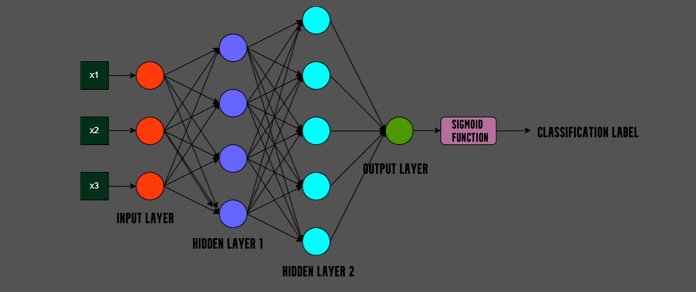

<h1 align="center">Classification with Neural Network</h1>

## 🚀 About Classification and Neural Network:-

Classification is a fundamental task in Machine Learning which involves classifying each record to predefined classes or labels using the independent variables. It has a wide range of applications, including image recognition, spam detection, sentiment analysis, and medical diagnosis.  Neural networks, particularly deep learning models, have transformed classification jobs by automatically learning hierarchical features from data, resulting in extremely accurate and scalable classification solutions across complex and heterogeneous datasets. In this project a Neural Network is built from scratch and used for the task of classification.

## 🛠️ Steps:-

- Explore the dataset. Normalize the independent variables.
- Split the data into train and test.
- Define the Neural Network - Have used two hidden layer network.
- Train and test the neural network using the train and test split.
- Compare the accuracy for different models.
- Try different approaches like hyperparameter tuning, learning rate scheduling, early stopping, batch normalization.

## 📊 Results:-

After tuning the hyperparameters the results can be compared with each other. The best model from these can be chosen as the base model.

| Name of Setup    | Learning Rate | Optimizer | Epochs | Testing Accuracy | Training Accuracy   |
|------------------|---------------|-----------|--------|------------------|---------------------|
| Setup-1          | 0.001         | SGD       | 120    | 59.86%           | 66.28%              |
| Setup-2          | 0.016         | Adam      | 100    | 70.39%           | 91.94%              |
| Setup-3          | 0.015         | SGD       | 100    | 78.94%           | 79.76%              |

The third model is chosen as base on which techniques such as early stopping, learning rate scheduling, and batch normalization are applied.

| Name of Setup             | Testing Accuracy | Training Accuracy   |
|---------------------------|------------------|---------------------|
| Learning Rate Scheduling  |  79.11%          | 76.31%              |
| Early Stopping - 75 epoch |  78.95%          | 76.97%              |
| Weight Initialization     |  80.26%          | 76.96%              |
| Batch Normalization       |  84.70%          | 72.36%              |

## ⚡ Technologies and Concepts Used:-

- `Python`
- `Pytorch`, `Scikit-Learn`, `Pandas`
- `Two Hidden Layer Neural Network`
- `Hyperparameter Tuning`
- `Early Stopping`, `Learning Rate Scheduling`, `Weight Initialization`, `Batch Normalization`

## 📈 Improvements:-

- Add more variables to the model that are relevant to the classification.
- Improve the quality of data.
- Can use ensemble methods.
- Try other methods such as logistic regression, KNN, Naive Bayes.
- Use cross validation and regularization methods if necessary.